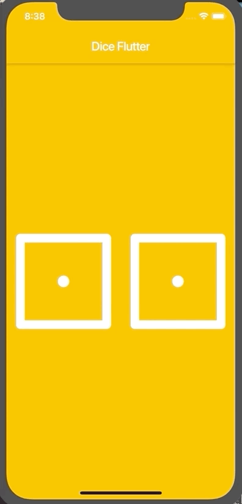

# Dice Flutter Example

- Ejemplo que muestra como crear dos Widget que contienen dos imagenes que permiten interactuar y cambiar las imagenes cada que se hace un tap sobre ellas.
- Como crear funciones en Flutter para ser llamadas al hacer el tap en las imagenes.
- Como importar y usar la libreria Math en Flutter.

